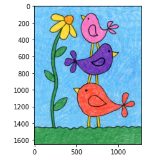
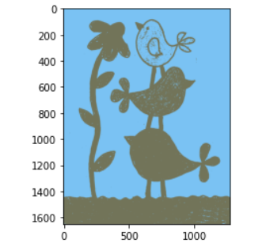

# Images-processing with OpenCV
This repository focuses on utilizing OpenCV, a popular open-source computer vision library, for various image processing tasks. OpenCV provides a wide range of functions and algorithms specifically designed for image processing, making it a powerful tool for developing image processing applications such as object detection, image smoothing image segmentation and more.
# contents
1 Image processing for Edge detection
2 Image processing for Edge detection
This technique segments the input image into different regions based on color, texture, or other visual characteristics.
# Before and after examples:

# Image processing for Edge detection
This technique detects and highlights objects of interest in the input image using diferent filters for example Laplacian, Sobel, Cany Filter and prewitt.
# Before and after examples

# Image processing with Smoothing filters
Image filters play a vital role in various image processing tasks, such as noise reduction, feature enhancement, and image restoration. The Smoothing_All_filters file provides efficient implementations of popular filters that can be easily integrated into your own projects.
# Filters
# Average Filter
The average filter is a simple and effective technique used in image processing to reduce noise and blur images. It works by replacing each pixel's value with the average of its neighboring pixels, typically within a square or rectangular window.
The average filter is widely used because of its simplicity and ability to preserve the overall image structure while reducing high-frequency noise. It is especially useful for smoothing images and preparing them for further analysis or visualization.

# Median Filter
The median filter is a nonlinear filter that replaces each pixel in an image with the median value of its neighboring pixels. It is effective in reducing impulse noise or salt-and-pepper noise, preserving edges, and preserving fine details.

# Minimum Filter
The minimum filter, also known as erosion, replaces each pixel in an image with the minimum value of its neighboring pixels. It can be used for noise reduction, edge detection, and morphological operations.

# Maximum Filter
The maximum filter, also known as dilation, replaces each pixel in an image with the maximum value of its neighboring pixels. It can be used for noise reduction, edge detection, and morphological operations.

# Histogram Equalization
Histogram equalization is a technique used to enhance the contrast and improve the overall appearance of an image. It redistributes the pixel intensities in an image to achieve a more balanced histogram, resulting in improved visual quality.

# Image processing with frequency domain filters

Image processing in the frequency domain involves transforming an image from the spatial domain to the frequency domain using techniques such as the Fast Fourier Transform (FFT). Frequency domain filters such as ideal filter, betterworth filter, and gaussian filters with high pass and low pass frequencies can then be applied to the transformed image to achieve desired effects such as noise removal, sharpening, or blurring.

The frequency_domain_filters file provides implementation of high pass and low pass filters, which are commonly used in frequency domain filtering. High pass filters allow for preserving and enhancing high-frequency components, while low pass filters enable smoothing and preserving low-frequency information in an image.
# Ideal low pass filter

# Ideal high pass filter

# Betterworth low pass filter

# Betterworth high pass filter

# Gussian low pass filter

# Gussian high pass filter

# Morphological image processing with opening-and-closing
Opening and closing operations are fundamental techniques in morphological image processing. They are used to improve image quality, remove noise, and modify the shape and connectivity of objects in an image.

Opening is a two-step operation that involves applying an erosion operation followed by a dilation operation. It is useful for removing small objects, thin lines, and noise from an image while preserving the larger structures.

Closing, on the other hand, is the reverse of opening. It consists of a dilation operation followed by an erosion operation. Closing is effective for filling small holes, joining broken structures, and smoothing the boundaries of objects.

The morphological_processing_with_opening_and_closing_task file provides implementation of opening and closing operations, allowing you to apply these morphological operations to your images.
# Opening and closing

# Errosion and dilation

# Contour detection and extraction

-a432e475fd5c)

